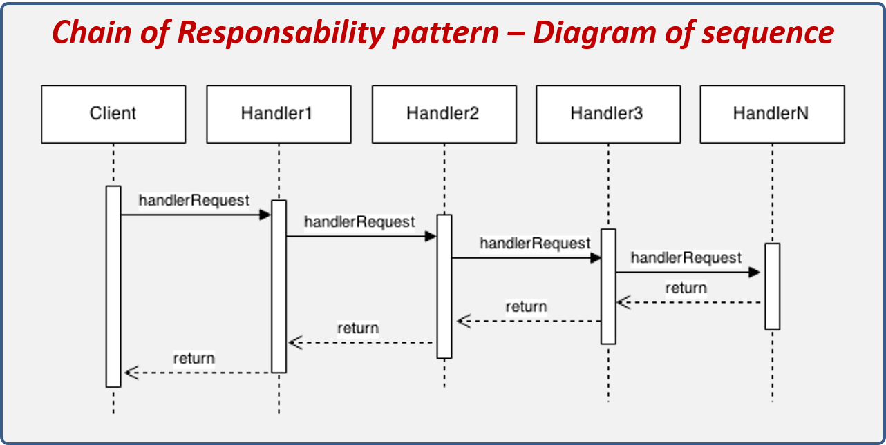

# Spring Kotlin Chain Of Responsibility

[](https://jitpack.io/#evmetatron/spring-kotlin-chain-of-responsibility)

Library for implementing chain of responsibility pattern

**Only for primary constructor**



The library is located in JitPack

## Add dependency

### Add library in pom

Add JitPack repository

```xml
<repositories>
    <repository>
        <id>jitpack.io</id>
        <url>https://jitpack.io</url>
    </repository>
</repositories>
```

Add Library

```xml
<dependency>
    <groupId>com.github.evmetatron</groupId>
    <artifactId>spring-kotlin-chain-of-responsibility</artifactId>
    <version>1.0</version>
</dependency>
```

### Add library in gradle (kotlin dsl)

Add JitPack repository

```kotlin
repositories {
    // ...
    maven ( url = "https://jitpack.io" )
}
```

Add Library

```kotlin
dependencies {
    implementation("com.github.evmetatron:spring-kotlin-chain-of-responsibility:1.0")
}
```

## Add beans

```kotlin
// Package with chain classes
@Bean
fun chainFactory(): ChainFactory =
    ChainFactory("com.test.chains")

// Add classes for sort. Other classes that implement the interface will 
// also be added, but sorted at the very end
@Bean
fun inputHandler(@Autowired chainFactory: ChainFactory): ChainInterface? =
    chainFactory.createChain(
        listOf(
            ChainA::class,
            ChainB::class,
        ),
    )
```